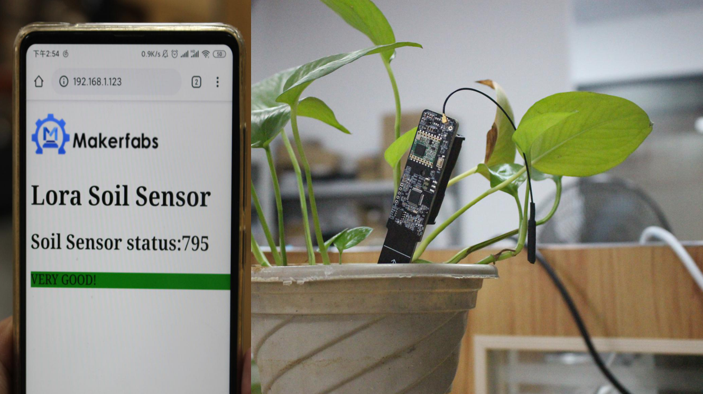

# Lora-Soil-Moisture-Sensor

```c++
/*
Version:		V2.0
Author:			UNKOWN
Create Date:	UNKOWN
Note:
	2020/7/24	v2.0: Rebuid readme,add pic. By Vincent
*/
```

[toc]

# Introduce

The Lora soil moisture sensor is based on Atmel's Atmega328P, it collect local air temperature/ humidity with sensor AHT10, and detect the soil humidity with capacitor-humility measurement solution with 555, and transmit the local environment data to the gateway, with Lora communication, suit for applications for smart-farm, irrigation, agriculture, etc.


- You can get one from: [Lora_Soil_Moisture_Sensor](https://www.makerfabs.com/lora-soil-moisture-sensor.html)

- Hardware and detailed instructions please visit Wiki page:  [Lora_Soil_Moisture_Sensor Wiki](https://www.makerfabs.com/wiki/index.php?title=Lora_Soil_Moisture_Sensor)

# Related Projects

## [Project_Soil-Moisture-Sensor-Wifi](https://github.com/Makerfabs/Project_Soil-Moisture-Sensor-Wifi)

- Control relay through wifi.

- [youtube:Lora soil moisture wifi](https://youtu.be/1wYAwtzNxJU)



## [Lora IoT Irrigation System](https://github.com/Makerfabs/Project_IoT-Irrigation-System)

- IoT agricultural irrigation experiment based on Lora communication.
- [YOUTUBE:Lora IoT Irrigation System - Outdoor Simulation Test](https://youtu.be/0mY6Ox0YvRk)

