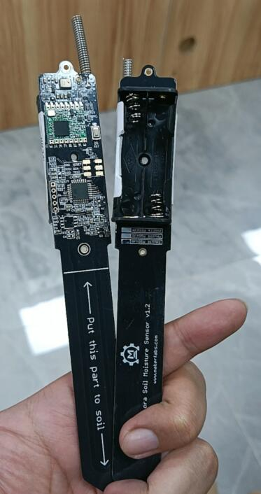

# Lora Soil Moisture Sensor V3

```c++
/*
Version:		V5.0
Author:			UNKOWN
Create Date:	UNKOWN
Note:
	2021/12/15	V5.2: Fix RadioHead demo can't setModemConfig. 
	2021/11/17  V5.1: Fix code bug,example "ESP32 Receiver" pin define wrong.
	2021/10/22	V5.0: Modify the document structure. 
	2021/9/26	V4.0: The new hardware removed the 555 chip, updated the BOM, and significantly improved battery life.
	2021/8/24	V3.1: Now can read ADC value without 555.
	2021/7/22	V3.0: Now support Lorawan to TTN.
	2020/10/26	v2.2: Add a power-save verson.Using watch dog and sleep mode.
	2020/8/24	v2.1: Add pcb file.
    2020/7/24	v2.0: Rebuid readme,add pic. By Vincent
*/
```

[toc]

# Makerfabs

[Makerfabs home page](https://www.makerfabs.com/)

[Makerfabs Wiki](https://makerfabs.com/wiki/index.php?title=Main_Page)


# Lora Soil Moisture Sensor V3

## Introduce

Product Link: [Lora_Soil_Moisture_Sensor](https://www.makerfabs.com/lora-soil-moisture-sensor.html)

Wiki Link:  [Lora_Soil_Moisture_Sensor_V3](https://www.makerfabs.com/wiki/index.php?title=Lora_Soil_Moisture_Sensor_V3)

The Lora soil moisture sensor is based on Atmel's Atmega328P, it collects local air temperature/ humidity with sensor AHT10, and detect the soil humidity with capacitor-humility measurement solution with MCU clock, and transmit the local environment data to the gateway, with Lora communication, suit for applications for smart-farm, irrigation, agriculture, etc. 

In applications, always you do not need to check the air/soil state continuously, have a test of them for few seconds after then minutes/hours sleeping is normally Ok for most projects. To save power, there the Air/ Soil measuring functional could be shut down in the working, so they can be only powered ON a short time and then a long time power off. With MCU in sleeping mode and low power consumption Lora module, this module works ok with 2 AAA battery more than one year. Besides, this sensor is coated with waterproof paint, which makes it longer working time in damp soil. 


## Feature

- Classic ATMEL AVR 8-bit Atmega328P, with Arduino Pro Mini(3.3V/8M bootloader pre-loaded) .
- Capacitor-humility measurement.
- AHT10 temperature and humidity sensor.
- Working with 2 AAA more than one years.
- 3D printed case.
- Waterproof coating.
- Unique ID, can be used directly without secondary programming.





## Hardware Update

We removed the 555 chip and made a lot of changes to the code. The current soil moisture test uses MCU clock pulses instead of those generated by the 555 chip. Sleep mode has also been optimized more.

Detailed power consumption data is being edited....


## Firmware

### Moisture_LowPower_RadioLib_v2.1.ino

The latest firmware is in:

V3\firmware\Moisture_LowPower_RadioLib_v2.1


### How to use
- The code contains a unique ID and sends Lora messages every 75 minutes in the following format:

```c++
String message = 
    "INEDX:" + (String)packetnum + " H:" + (String)humidity + 
    " T:" + (String)temperature + " ADC:" + (String)sensorValue + 
    " BAT:" + (String)batValue;

String back_str = node_id + " REPLY : SOIL " + message;

//Full message example:
//ID010123 REPLY : SOIL INEDX:0 H:48.85 T:30.50 ADC:896 BAT:1016
```

- If you want to change the time, you can change it:

```c++
//Set sleep time, when value is 1 almost sleep 20s,when value is 450, almost 1 hour.
//Each sleep cycle almost 8s.
#define SLEEP_CYCLE 1

```

- The degree of soil ADC is about 900 in air (completely dry) and 600 in water (completely wet).


## Usage

### Receiver

A simple receiver demo is provided. You can use another Lora Moisture or Maduino Lora Radio as the receiver.

Receive data through serial port display.

The receiver code is in: V3\example\Lora_Receiver_v1.0


### ESP32 Receiver

A simple receiver demo is provided. You can use a MakePython Lora as the receiver.

Receive data and display on SSD1306.


### RadioHead Demo

The default parameters of RadioLib can reach about 800m communication distance, of course can be further, but we do not have time to debug Lora parameters.

We provide an example that can reach 1.7km communication distance, which was debugged by a former colleague. It used to depend on some AVR libraries This made ESP32 unable to complier ReadHead library at the time, so we switched to RadioLib instead. But the latest version, ReadHead is available under ESP32.

Please download the latest [RadioHead](http://www.airspayce.com/mikem/arduino/RadioHead/)

